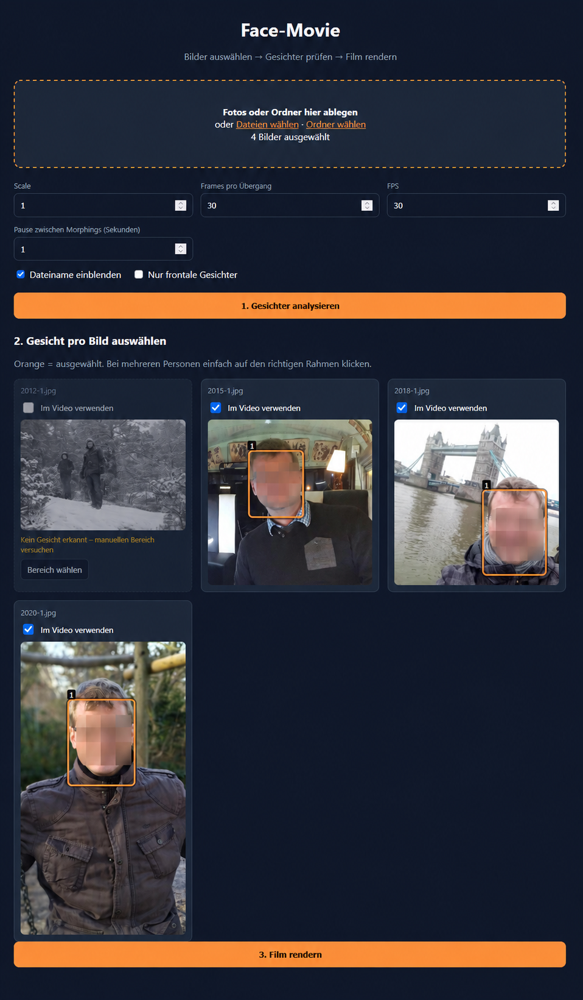

# Face-Movie – Face Select Extension

A privacy-friendly local fork of **Face-Movie** focused on real photo archives: group photos, small faces, difficult scans, and manual control over which photos actually enter the final movie.

This fork keeps the original Face-Movie morphing pipeline and adds an interactive review step before rendering.

## Web Interface

The extended Web UI provides a complete workflow for selecting images, reviewing detected faces, excluding unsuitable photos, and rendering the final face-morphing video.



## Features Added in This Fork

* Detect up to **10 faces per photo** and select the correct face directly in the Web UI.
* Multi-pass face detection using normal and sensitive detection, 2× upscaling, CLAHE contrast enhancement, and overlapping zoom tiles.
* Manual crop fallback for difficult, small, or otherwise undetected faces.
* **Include or exclude individual photos after analysis.**
* Photos without a detected face start excluded automatically.
* A successful manual crop can enable an excluded photo again.
* Configurable still-image pause between morphs, specified in seconds.
* Pause duration is calculated using the selected output FPS.
* Adjustable transition frames and output FPS.
* Optional upstream front-facing face filter.
* CPU-first Docker setup suitable for headless systems and NAS deployments.
* Local processing: photos do not need to be uploaded to an external service.

## Web Workflow

1. Select individual photos or an entire folder.
2. Configure scale, transition frames, FPS, and the optional pause between morphs.
3. Click **Gesichter analysieren**.
4. Review the detected faces for each image.
5. If multiple faces were detected, click the correct face box.
6. Disable **Im Video verwenden** for photos that should not appear in the movie.
7. If no face was detected, click **Bereich wählen** and draw a generous box around the face and head.
8. Verify that at least two photos remain enabled.
9. Click **Film rendern**.
10. Download the generated MP4.

## Face Detection

The original Face-Movie pipeline normally works with a single detected face. This fork adds a review-oriented detection stage capable of finding multiple candidates.

Detection is attempted using several strategies:

* normal detection
* sensitive detection
* 2× image upscaling
* CLAHE local contrast enhancement
* upscaling combined with contrast enhancement
* overlapping zoom tiles for small faces
* manual crop analysis as a fallback

Candidate detections are merged using bounding-box overlap so the Web UI can present distinct faces without displaying obvious duplicate detections.

These detection enhancements are used only to locate the face and landmarks. The original source image is retained for the actual morphing process.

When a face is found using a manually selected crop, the crop coordinates are retained for rendering. This prevents a difficult face from disappearing when the full-resolution image is processed again during the final render.

## Image Selection

Every analyzed photo can be individually enabled or disabled using **Im Video verwenden**.

Photos without a detected face are excluded automatically. A successful manual face selection can enable the photo again.

Excluded photos are removed before the morphing pipeline runs. They therefore do not affect:

* face alignment
* morph transitions
* transition pauses
* render progress
* final video duration

At least **two enabled photos** are required to render a movie.

## Transition Pause

The Web UI allows a pause to be inserted between morphing transitions.

The pause is specified in seconds and converted to still frames using:

```text
pause frames = pause seconds × output FPS
```

For example:

```text
1 second at 30 FPS = 30 still frames
1 second at 60 FPS = 60 still frames
```

The pause occurs after an image has been fully reached and before morphing to the next image. No additional pause is added after the final image.

## Docker

The repository contains its own Dockerfile and can be built directly from the source code of this fork.

Build and start the application with:

```bash
docker compose up --build -d
```

The included `compose.yaml` exposes the Web UI on port **8098**.

Open the application in a browser using your Docker host or NAS address and port `8098`.

No Python installation is required on the host when running Face-Movie through Docker.

### Docker Image

The Docker build uses `python:3.12-slim` and installs the required runtime libraries, including:

```text
ffmpeg
libgl1
libegl1
libgles2
libglib2.0-0
```

`libegl1` and `libgles2` are included for MediaPipe compatibility in headless/container environments.

Face detection defaults to the CPU delegate.

## Synology Container Manager

The included `compose.yaml` is suitable as a starting point for Synology Container Manager deployments.

Default configuration:

```text
Container port: 8080
Host port:      8098
Delegate:       CPU
Restart policy: unless-stopped
```

The application has been designed to work without a desktop environment or GPU dependency, making it suitable for NAS-style deployments.

The Web UI itself has no authentication. **Do not expose the container directly to the public Internet.**

## Settings

| Setting                  | Meaning                                                              |
| ------------------------ | -------------------------------------------------------------------- |
| Scale                    | Output resolution scale                                              |
| Frames pro Übergang      | Number of morph frames between two included photos                   |
| FPS                      | Output video frame rate                                              |
| Pause zwischen Morphings | Still-image duration between morph transitions, specified in seconds |
| Dateiname einblenden     | Burns the source filename into the generated video                   |
| Nur frontale Gesichter   | Enables the upstream front-facing face filter                        |

## Project Structure

```text
face_select_extension.py   Extended face detection, selection and pause integration
main.py                    Original Face-Movie morphing pipeline
webapp/server.py           Analysis, crop and rendering API
webapp/static/index.html   Extended Web UI
Dockerfile                 Self-contained container build
compose.yaml               Docker / NAS deployment example
docs/                      Screenshots and documentation assets
```

## Privacy

Face-Movie is intended for local photo processing.

Photos are processed by the locally running application rather than being sent to an external face-processing service.

For sensitive photo collections, the application should remain accessible only from trusted systems or networks.

## Upstream Project

This project is a fork of **leachiM2k/face-movie**.

The original project provides the core face alignment, Delaunay triangulation, morphing, and video encoding pipeline. This fork builds on that work and adds the extended face-selection and review workflow.

The GitHub fork relationship and original project history are intentionally retained.

## Development

Docker is the recommended runtime and development path.

For native Python development, dependencies are defined in `requirements.txt`.

A basic Python syntax check can be performed with:

```bash
python -m py_compile main.py face_select_extension.py webapp/server.py
```

To build the complete container locally:

```bash
docker compose build
```

To start it:

```bash
docker compose up -d
```

## Status

This fork is primarily intended for local and personal photo-archive processing.

The extended workflow is particularly useful for photo collections containing:

* multiple people
* small faces
* older photographs and scans
* difficult lighting or contrast
* faces that automatic detection cannot reliably locate

## License and Attribution

This fork retains the history and attribution of the original Face-Movie project.

Refer to the repository's license file for the applicable license terms.
